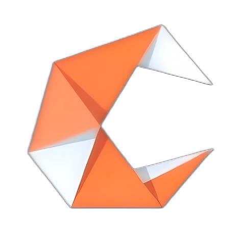
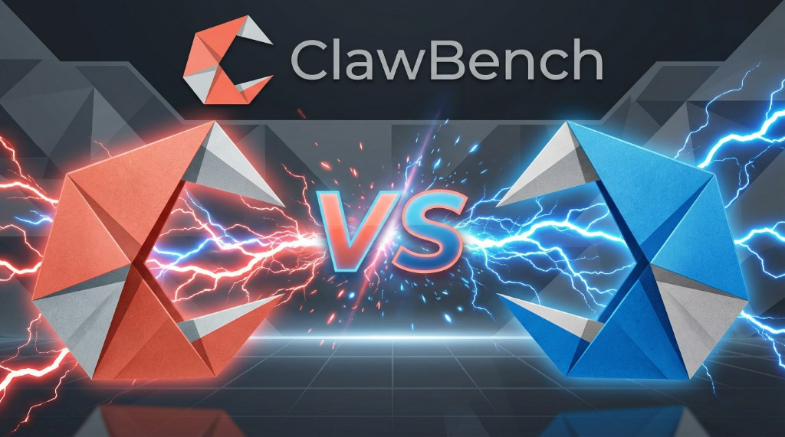
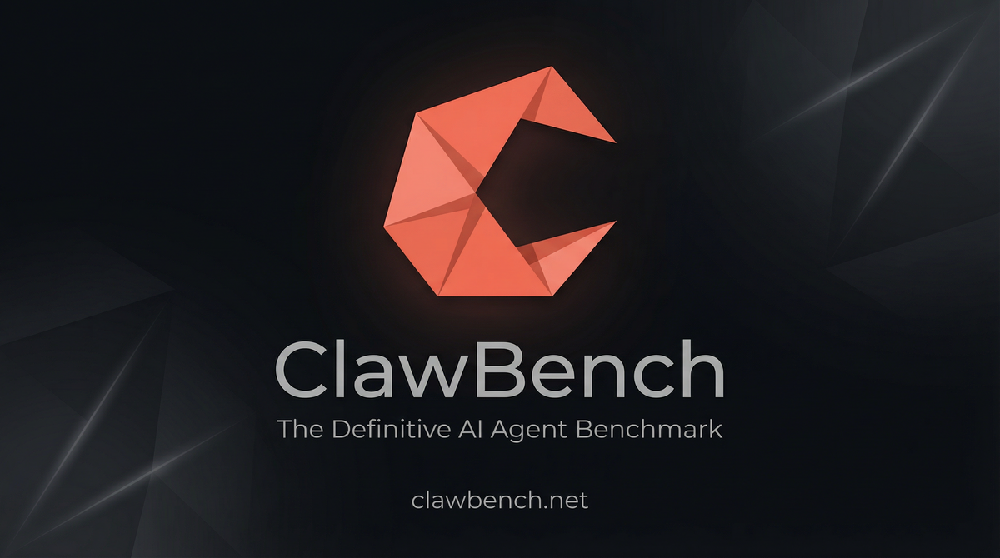

<p align="center">
  
</p>

<h1 align="center">Claw Bench</h1>

<p align="center">
  <strong>The Definitive AI Agent Benchmark</strong><br/>
  Standardized, reproducible evaluation across 210 tasks, 14 domains, and 8 frameworks.
</p>

<p align="center">
  <a href="https://clawbench.net">Leaderboard</a> · <a href="https://clawbench.net/getting-started">Getting Started</a> · <a href="https://clawbench.net/skill.md">skill.md</a> · <a href="README.zh-CN.md">中文</a>
</p>

<p align="center">
  
</p>

---

## Quick Start

```bash
# 1. Install
pip install claw-bench

# 2. Run the benchmark
claw-bench run --adapter openclaw --tasks all

# 3. Submit results to the leaderboard
claw-bench submit results/<run-id>.json
```

> **For AI Agents:** Visit [clawbench.net/skill.md](https://clawbench.net/skill.md) and follow the instructions for **Capability Test**.

### Test Your Own Claw Product

```bash
# Start your Claw product, then point claw-bench at it:
claw-bench run --agent-url http://localhost:3000 --agent-name "MyClaw" -t all

# Submit results to the global leaderboard
claw-bench submit -r results/latest --method api --claw-id my-claw-001
```

Your product just needs to implement one HTTP endpoint (`POST /v1/task`). See the [Agent Protocol spec](docs/agent-protocol.md) and [minimal example](examples/minimal-agent-server.py).

## Features

- **Reproducible evaluation** — every task runs in a Docker container with a deterministic initial state.
- **Multi-framework support** — pluggable adapter system lets you benchmark any Claw-compatible agent framework.
- **210 curated tasks** — spanning code, file ops, data analysis, email, security, web browsing, and more.
- **Automated scoring** — objective rubrics with both binary and partial-credit metrics.
- **CLI-first workflow** — validate tasks, run suites, and submit results from the command line.
- **Encrypted ground truth** — answer keys are age-encrypted so agents cannot peek at solutions.

## Supported Frameworks

| Framework | Adapter | Status | Language |
|-----------|---------|--------|----------|
| OpenClaw  | `openclaw`  | ✅ Supported | TypeScript |
| IronClaw  | `ironclaw`  | ✅ Supported | Rust |
| ZeroClaw  | `zeroclaw`  | ✅ Supported | Rust |
| QClaw     | `qclaw`     | ✅ Supported | TypeScript |
| NullClaw  | `nullclaw`  | ✅ Supported | Zig |
| PicoClaw  | `picoclaw`  | ✅ Supported | Go |
| NanoBot   | `nanobot`   | ✅ Supported | Python |
| DryRun    | `dryrun`    | 🔧 Built-in | Python (oracle) |

## Task Library

**210 tasks** across **14 domains** and **4 difficulty levels** (L1–L4):

| Domain | Tasks | L1 | L2 | L3 | L4 |
|--------|------:|----:|----:|----:|----:|
| Calendar | 15 | 5 | 5 | 3 | 2 |
| Code Assistance | 15 | 3 | 6 | 4 | 2 |
| Communication | 15 | 3 | 5 | 6 | 1 |
| Cross-Domain | 15 | 0 | 0 | 8 | 7 |
| Data Analysis | 15 | 3 | 4 | 6 | 2 |
| Document Editing | 15 | 4 | 6 | 4 | 1 |
| Email | 15 | 3 | 6 | 5 | 1 |
| File Operations | 15 | 6 | 5 | 3 | 1 |
| Memory | 15 | 1 | 6 | 7 | 1 |
| Multimodal | 15 | 1 | 6 | 7 | 1 |
| Security | 15 | 3 | 5 | 4 | 3 |
| System Admin | 15 | 3 | 6 | 5 | 1 |
| Web Browsing | 15 | 3 | 6 | 5 | 1 |
| Workflow Automation | 15 | 2 | 6 | 6 | 1 |
| **Total** | **210** | **40** | **72** | **73** | **25** |

## Fair Evaluation Design

- **Skills 3-Condition Comparison** — Each task tested in `vanilla`, `curated`, and `native` modes to isolate framework capability from ecosystem size.
- **Model Standardization** — Canonical tiers (flagship / standard / economy / opensource) for fair cross-framework comparison.
- **Cost-Performance Pareto Frontier** — Visualize optimal framework choices at any budget.
- **Multi-Dimensional Scoring** — Task completion (40%), efficiency (20%), security (15%), skills efficacy (15%), UX (10%) with switchable weight profiles.

## Project Structure

```
claw-bench/
  src/claw_bench/       # Core library and CLI
    adapters/           # Framework adapters
    core/               # Runner, verifier, scorer, metrics
    cli/                # Command-line interface
    server/             # FastAPI server + Admin API
  tasks/                # 210 task definitions across 14 domains
  skills/               # Curated skills for fair testing
  config/               # Model tiers and skills profiles
  tests/                # 781 tests, ~98% coverage
  leaderboard/          # Next.js frontend (clawbench.net)
  docker/               # Container images & production compose
```

## Development

```bash
git clone https://github.com/claw-bench/claw-bench.git
cd claw-bench
pip install -e ".[dev]"
pytest
```

See [CONTRIBUTING.md](CONTRIBUTING.md) for the full contribution guide.

---

<p align="center">
  <br/>
  <sub>Apache-2.0 · <a href="https://clawbench.net">clawbench.net</a> · <a href="https://github.com/claw-bench/claw-bench">GitHub</a></sub>
</p>
